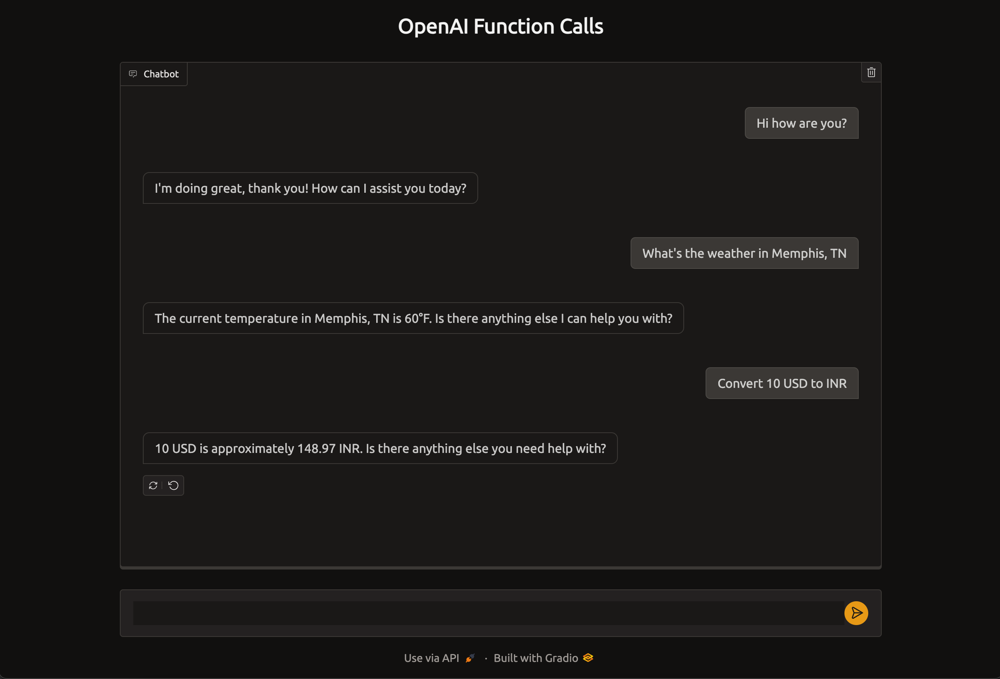

# OpenAI Function Calls
OpenAi function calling in completion API helps us to call our custom functions from OpenAI results. Please see 
https://platform.openai.com/docs/guides/function-calling for a documentation. 

Here I am defining a master agent and two dummy sub agents to demonstrate this.



### Master Agent
master_agent.py defines the master agent. Master agent has the list of sub agents and different functions of sub agents.
We pass the user input, and the list of sub agent function definitions to OpenAI. Then the OpenAI will determine which 
function(s) to call based on the user input. Then the master agent calls the corresponding functions of sub agents and 
store the results in the history. The results will be again given to OpenAI to get a humanised response.

### Forex Agent
forex_aganet.py defines the forex sub agent. This has the implementation of get_latest_forex and convert functions

### Weather Agent
weather_agent.py has the weather sub agent. It has the function to retrive the weather of a city.

### Main App using Gradio
Gradio is a very good tool to build web uis. We can create a chat interface on one line of code. Please see main.py for 
the sample implementation. 

## How to add a new sub agent?
Consider we need to create an agent for stock market. This agent will return the end-of-day data for one or more stock
tickers. We need to follow the steps
1. Create a new class which inherits from SubAgent. So we have to create a python file stock_agent which will have the 
   class declaration ```class StockAgent(SubAgent):```
2. Implement the required function. Here we will write a method ```def get_eod_data(self, params):```. This function can
   have only one parameter which will be a dictionary. We can get the details of each parameter like 
   ```tickers = params["tickers"]``` etc. Get the data from a web service call or from database or from any other source
   and return the data as json.
3. Implement the method ```get_function_schema```. **This should return the json shcema of the above function**. So we 
will be retuning something lile
   ```  
   def get_function_schema(self):
        return [{
            "type": "function",
            "function": {
                "name": "get_eod_data",
                "description": "get end of the day data of stock tickers. Ticker name is required",
                "parameters": {
                    "type": "object",
                    "properties": {
                        "tickers": {
                            "type": "string",
                            "description": "The ticker names, e.g. AAPL, MSFT",
                        },
                    },
                    "required": ["tickers"],
                    "additionalProperties": False
                },
            },
        }]
   ```
4. Add the StockAgent to master agent. Open master_agent.py, modify the init method to add our newly created sub agent.
``` buildoutcfg
    def __init__(self):
        """ Here you need to initialize all your sub agents """
        ....
        ....
        self.add_sub_agent(StockAgent())
```
That's it. Run the application, and you can see that the chatbot is calling your service and showing data.
